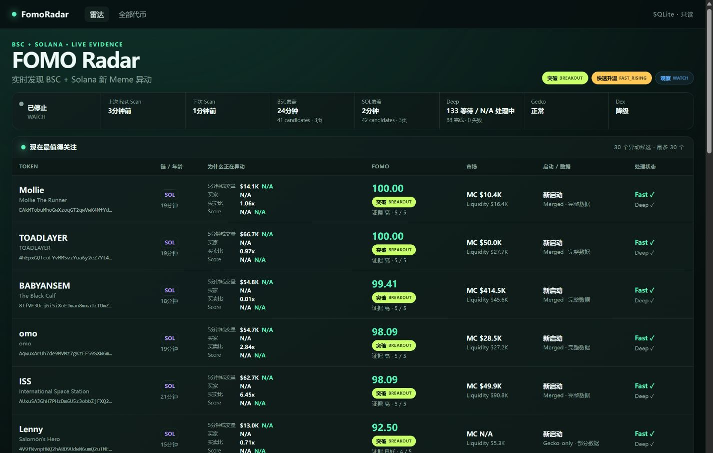
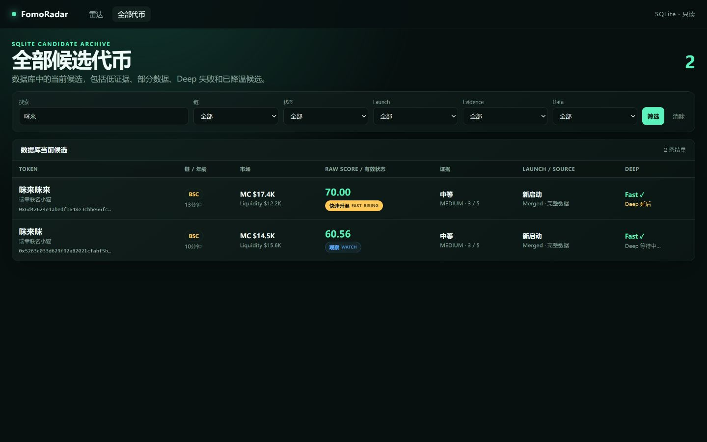
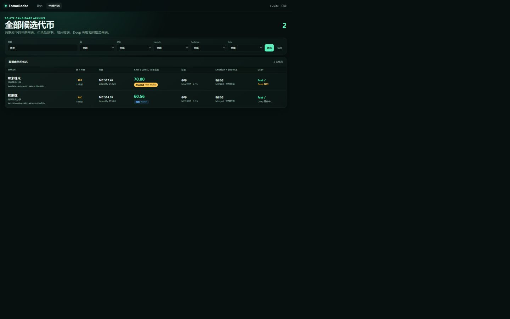
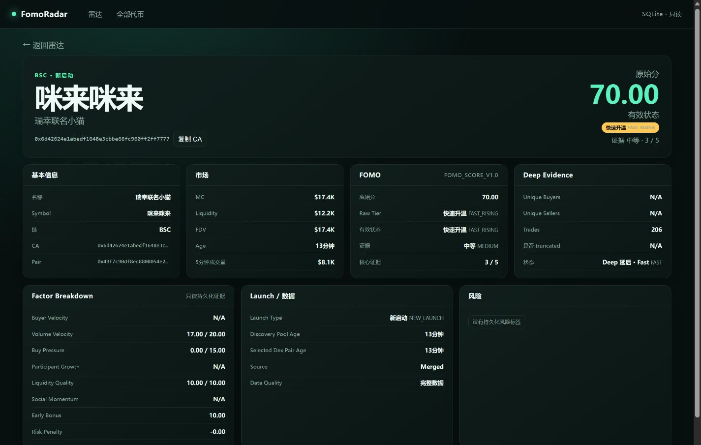
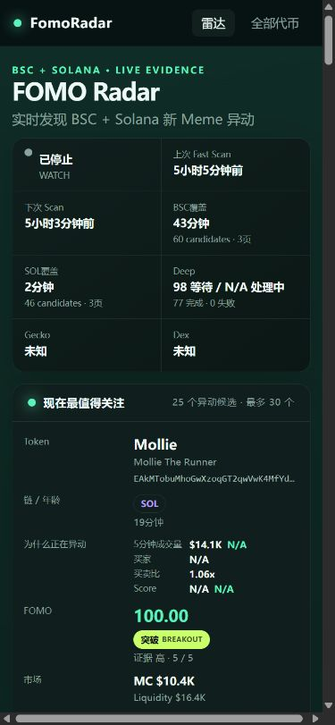

# Dashboard Phase 1 Refinement Report

Date: 2026-08-22

## Result

Dashboard Phase 1 refinement is complete. Radar and Tokens now have different
data scopes, the UI is Chinese-first, Unicode works through SQLite/HTML/JSON,
current momentum is visible on Radar, and scanner coverage/status comes only
from persisted SQLite data.

Core Scanner, Discovery, FOMO_SCORE_V1.0, thresholds, DeepQueue, provider
pacing, and Telegram code were not modified.

## Modified Files

- `internal/web/models.go`
- `internal/web/repository.go`
- `internal/web/repository_test.go`
- `internal/web/server.go`
- `internal/web/server_test.go`
- `internal/web/templates/radar.html`
- `internal/web/templates/token.html`
- `internal/web/assets/style.css`
- `docs/plan2-dashboard-design.md`
- `docs/plan2-implementation-report.md`

## Added Files

- `internal/web/refinement_test.go`
- `internal/web/templates/tokens.html`
- `docs/dashboard-phase1-refinement-radar.png`
- `docs/dashboard-phase1-refinement-tokens.png`
- `docs/dashboard-phase1-refinement-chinese-search.png`
- `docs/dashboard-phase1-refinement-token-detail.png`
- `docs/dashboard-phase1-refinement-mobile.png`

## Radar vs Tokens

Radar is a 30-token activity surface. It contains `BREAKOUT`, `FAST_RISING`,
and only `HIGH/GOOD` WATCH candidates. It sorts by Effective Tier, stored
five-minute Score acceleration, Raw Score, Evidence Confidence, and age.

Tokens is the current database archive, capped at 500 rows. It includes
`MEDIUM/LOW` WATCH, `HIDDEN`, partial/Gecko-only, failed/deferred Deep, and
reactivation candidates. Search and chain/Tier/Launch/Evidence/Data filters are
server-side SQLite reads.

## Why a Token Is Moving

Radar rows now show:

- 5-minute volume and change;
- buyers before/current;
- buy/sell ratio;
- Raw Score before/current and delta;
- MC, Liquidity, evidence, launch/source quality, and Deep state.

All changes compare current persisted data with a stored row from the previous
five minutes. Insufficient evidence shows `N/A`, never zero.

## Chinese and Unicode

Verified in automated tests and against the live acceptance database:

- Chinese names/Symbols: `牛来`, `黑马`, `Burn牛来`, `我踏马来了`;
- emoji Symbol rendering;
- Chinese SQLite substring search;
- literal UTF-8 Chinese/emoji in `/api/tokens`;
- `html/template` Unicode preservation and HTML escaping.

Live `/api/tokens` returned 212 candidates, including 34 with Chinese
name/Symbol data.

## Scanner Status and Coverage

The status strip reads `scan_runs`, `discovery_coverages`, and current Deep
states. It displays the actual stored BSC/Solana windows, never “最近2小时”.

Live watch observations included:

- first round: BSC 48 candidates, BSC coverage 24m23s; Solana Gecko request
  received HTTP 429 and BSC continued;
- next round: BSC 41 candidates with 24m40s coverage, Solana 42 candidates with
  2m43s coverage;
- persisted Deep state reached 64 queued, 4 in flight in Scanner memory, and
  completed Deep snapshots.

Dashboard cannot read the in-memory worker count, so Deep Running renders
`N/A`. It does not fabricate zero. A regression test ensures a new `running`
watch row does not hide provider health from the latest completed row.

## Screenshots

Radar and scanner status:



Tokens archive with Chinese search:



Chinese search result:



Chinese Token detail and Score Timeline:



390px responsive Radar:



## API

Routes remain:

| Route | Result |
| --- | --- |
| `GET /` | Activity Radar + persisted scanner status |
| `GET /tokens` | Full filtered candidate archive |
| `GET /token/{address}` | Stored evidence and timeline |
| `GET /api/tokens` | Filtered UTF-8 JSON DTO envelope |

`/tokens` and `/api/tokens` accept `q`, `chain`, `tier`, `launch`, `evidence`,
and `data` query parameters. JSON encoding streams directly to the response;
factor/risk DTO fields remain available.

## SQLite Invariants

- URI `mode=ro`;
- `PRAGMA query_only=ON`;
- `PRAGMA busy_timeout=5000`;
- one open/idle connection;
- WAL required;
- no migration or write statement;
- Fast/Deep generation lineage retained;
- timeline reads stored snapshots without score recalculation.

Tests reject `CREATE` and `UPDATE`. GET requests across Radar, Tokens, detail,
and API leave token/snapshot/scan-run counts unchanged.

## Tests

TDD RED failures were observed before implementation for Radar range, Chinese
UI/search, Low Evidence Tier Gate, momentum, Coverage, and provider health
during an in-progress watch run.

Final commands:

```powershell
go test -count=1 ./internal/web ./cmd/fomo-server
go vet ./internal/web ./cmd/fomo-server
go build -buildvcs=false -trimpath -ldflags="-s -w" -o fomo-server.exe ./cmd/fomo-server
```

Results:

- `internal/web`: PASS
- `cmd/fomo-server`: PASS
- scoped `go vet`: PASS, no output
- Windows binary: 13,008,896 bytes

An official portable Go 1.26.0 Windows amd64 ZIP was used because Go was not
on the current PowerShell PATH. SHA-256 matched go.dev:
`9bbe0fc64236b2b51f6255c05c4232532b8ecc0e6d2e00950bd3021d8a4d07d4`.
No module dependency was added or upgraded.

## Resource Test

With recommended `GOMAXPROCS=2`:

- Server mixed 100-request run: 0 HTTP failures;
- Server baseline Working Set: 25.27 MiB;
- Server peak Working Set: 35.81 MiB;
- concurrent Scanner peak: 53.36 MiB;
- concurrent Server peak: 34.32 MiB;
- concurrent combined peak: 87.33 MiB;
- concurrent Radar requests: 0 HTTP/SQLite lock failures.

Without the cap, an artificial 100-request API stress reached about 53.4 MiB.
GC traces showed only 0–4 MiB live Go heap; the difference came from eight Go
scheduler Ps/threads and Windows resident runtime pages, not a retained token
heap. The low-resource startup therefore recommends `GOMAXPROCS=2`.

## Startup

Terminal 1:

```powershell
cd "C:\Users\Alen1\Documents\ChatGPT\FomoRadar\.worktrees\fomo-core-scanner"
$env:HTTP_PROXY="http://127.0.0.1:10808"
$env:HTTPS_PROXY="http://127.0.0.1:10808"
$env:FOMO_DB="$PWD\fomo.db"
$env:GOMAXPROCS="2"
.\fomo-scanner.exe -watch
```

After `fomo.db` exists, Terminal 2:

```powershell
cd "C:\Users\Alen1\Documents\ChatGPT\FomoRadar\.worktrees\fomo-core-scanner"
$env:GOMAXPROCS="2"
.\fomo-server.exe -serve -db "$PWD\fomo.db" -listen 127.0.0.1:8080
```

Open `http://127.0.0.1:8080/`.

## Answers to Acceptance Questions

- Radar and Tokens clearly differ: yes.
- Chinese works end-to-end: yes, including SQLite search and literal JSON.
- Radar explains why a token is moving: yes, using stored momentum deltas.
- Real BSC/Solana coverage is shown: yes.
- SQLite remains read-only: yes.
- Core Scanner was modified: no.
- Telegram Phase was entered: no.

Phase 1 refinement stops here for acceptance.
